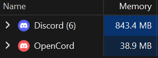
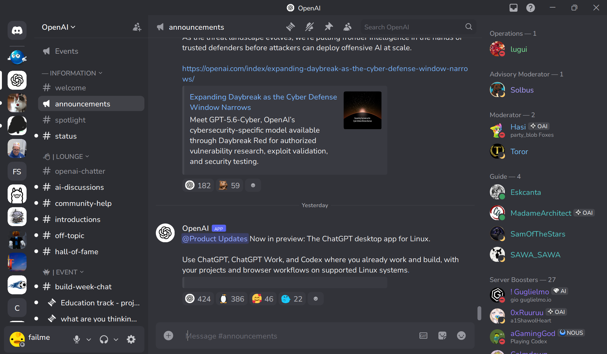

# OpenCord — a lightweight native Discord client for Windows

Low-ram Discord client built in C#. No Electron.

<div align="left">



</div>

<div align="center">



real screenshot

</div>

## Features

- **Text**: channels, threads, DMs, group DMs, reactions, replies, polls,
  embeds, stickers, slash commands, etc.
- **Calling**: voice & video calls, screensharing
- **UI**: closely matches real Discord UI
- **Low memory**: typical usage of **30-70mb** ram, compared to Discord's >800mb ram
- Desktop notifications & pings
- No nitro, quest, or promotional bloat

## Fetching your Discord token
1. Login to Discord (web version or Windows app) and open a DM or server
2. Open DevTools (Ctrl+Shift+I) and navigate to the Network tab
3. Refresh (Ctrl+R)
4. In the Network tab, filter URLs for "messages" (you should see something like "messages?limit=10")
5. Click on it to show the Headers tab
6. Scroll down until you reach Request Headers
7. Copy the token next to "Authorization"

## Running
Go to [Releases](https://github.com/failme/OpenCord/releases) and download the latest exe

You will need a Discord account token to log in

## Building
- Requires .NET 8 SDK
```
dotnet build
dotnet run
```

## License

MIT — see [LICENSE](LICENSE).
